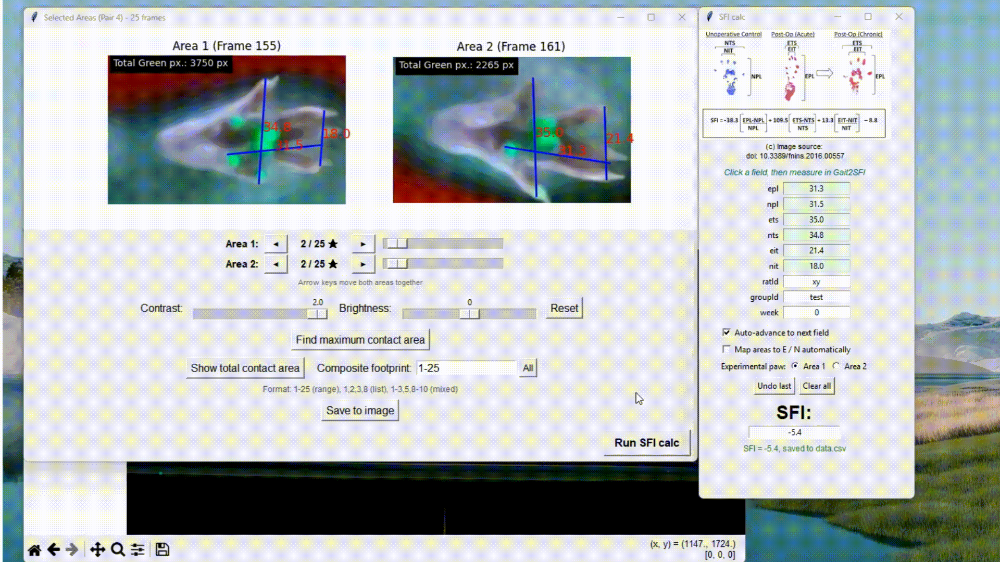
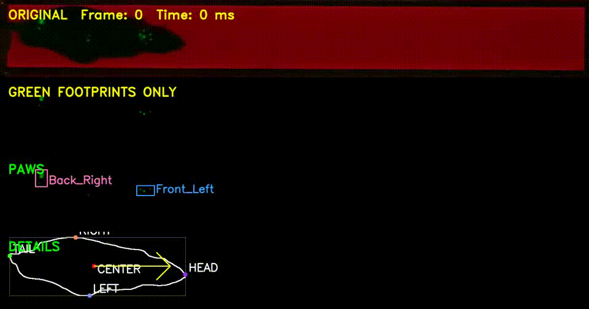

# Gait2SFI

Gait2SFI is a package of scripts for the semi-automated computation of the Sciatic Functional Index (SFI) from video recordings of rodent locomotion, developed for the rat sciatic nerve injury model. The package allows an investigator to locate suitable hind paw prints in a walking-track recording, measure the print parameters required by the SFI formula, compute the index, and export the results in a form suitable for statistical analysis. A companion script performs unsupervised detection of all paw contacts in a recording and labels them by limb.

The method is intended for neuroscience, preclinical studies of peripheral nerve regeneration, and quantitative behavioural analysis in laboratory animals.

## Principle of measurement

The walkway consists of a glass plate illuminated with green light from its edge. When a paw presses against the glass, the total internal reflection is frustrated, causing light to scatter toward a camera positioned beneath the plate. The resulting paw print appears as a bright region, whose area and intensity increase with contact pressure. A second, red illumination source positioned above the plate renders the animal as a dark silhouette against a bright background, allowing the body to be segmented independently of the paw prints. The third light source is white and directed parallel to the glass plate to optionally highlight the morphology of the animal's paws. This arrangement is a form of frustrated total internal reflection (FTIR) imaging.

## Getting started

The package has been tested under Windows and Linux.

### Installation

The most convenient way to run the scripts is from an Anaconda distribution, after creating an environment with Python 3.9 or later. Open the environment terminal and clone the repository:

```
conda install -c anaconda git
git clone https://github.com/olbmv/Gait2SFI.git
```

Alternatively, download the files manually and copy them into the environment directory. Then, from the environment terminal, install the required libraries:

```
pip install -r Gait2SFI/requirements.txt        # Linux
pip install -r Gait2SFI\requirements.txt        # Windows
```

The requirements install OpenCV, NumPy, matplotlib and Pillow. Every other module used by the scripts belongs to the Python standard library.

#### Installation on Linux

`tkinter` is part of the Python standard library, and is included with the Python interpreter on Windows and in Anaconda environments. On Linux distributions that use a system Python, it is provided by a separate package that must be installed before the scripts are run:

```
sudo apt install python3-tk libgl1     # Debian / Ubuntu
sudo dnf install python3-tkinter mesa-libGL     # Fedora / RHEL
```

`libgl1` (or `mesa-libGL`) is required by OpenCV to load its shared libraries. If the scripts are run inside an Anaconda environment on Linux, no additional system packages are required.


### Contents of the package

| Script | Purpose |
| --- | --- |
| `Gait2SFI.py` | Frame-by-frame search for hind paw prints and measurement of SFI parameters |
| `SFI.py` | Calculator that converts the measured parameters into the Sciatic Functional Index |
| `Gait2Paws.py` | Unsupervised detection and labelling of all paw contacts in a recording |
| `video_example.mp4` | Sample recording for script testing |
| `Gait2SFI_Demo.mp4` | Demo for Gait2SFI |
| `Gait2Paws_Demo.mp4` | Demo for Gait2Paws |

`Gait2SFI.py` and `SFI.py` are used together and must reside in the same directory. `Gait2Paws.py` is independent and may be run separately.

```
python Gait2SFI\Gait2SFI.py     # interactive measurement of SFI parameters
python Gait2SFI\SFI.py          # SFI calculator, standalone use
python Gait2SFI\Gait2Paws.py    # automatic gait analysis
```

`SFI.py` does not need to be started manually when working with `Gait2SFI.py`: it is opened from within the main application, which additionally enables the automatic transfer of measurements described below.

## Gait2SFI.py

### Selecting the recording and the prints

Select a video recording of rodent locomotion in the dialog box. The main window displays the recording with a slider spanning the entire file, from frame 0 to the last frame inclusive. Individual frames may be reached with the slider, with the arrow buttons, or by entering a frame number in the **Go to Frame** field.

The computation of the SFI requires two prints: the contralateral (control) hind paw, conventionally the right, and the hind paw with the injured sciatic nerve, conventionally the left. Locate a frame containing a satisfactory print of the control paw and enclose it in a rectangle by dragging with the left mouse button held down. Then locate a frame containing a satisfactory print of the injured paw and repeat the operation.

The field **Set how many frames to take from the selection** determines how many consecutive frames are made available for each selected region; the default is 15. If the selection is made close to the end of the recording, the sequence is truncated to the frames that actually exist rather than padded.

### The measurement window

After both regions have been selected, a second window opens showing the two regions side by side at increased magnification.

**Measurement.** Two successive clicks with the left mouse button define a segment; its length is displayed on the image and retained. Clicking with the right mouse button clears all measurements in the window. The measured distance is scaled by a fixed factor defined in the source code, which reduces the number of digits to be handled. The scale factor does not affect the SFI: the index is composed exclusively of ratios of the form (E − N) / N, in which any linear scale common to both paws cancels. The factor must be replaced by a proper calibration against a reference object of known length only if absolute print dimensions are to be reported.

**Navigation within the selection.** The slider beneath the images, the arrow buttons, and the up and down arrow keys move through the frames captured with each region. The counter beside the buttons indicates the current position within the selection.

**Find maximum contact area.** Every frame of the selection is examined and each region is set to the frame with the largest contact area, that is, the moment of fullest weight bearing. The frame chosen in this way is retained across redrawing operations, including the clearing of measurements, and is released only when the frames are changed deliberately with the slider or the arrow buttons.

**Show total contact area.** The contact areas of several frames are accumulated into a single image, which is useful when a single frame does not capture the whole print. The field **Composite footprint** determines which frames of the selection contribute. Positions are numbered from 1 within the selection and the following forms are accepted:

| Entry | Frames summed |
| --- | --- |
| `1-15` | all frames of the selection |
| `1-8` | frames 1 to 8 |
| `1,2,3,8` | only the listed frames |
| `1-3,5,8-10` | ranges and individual frames combined |

The **All** button restores the complete range. The number of green pixels reported for each region may be used as a measure of limb recovery, since the area of contact with the glass, and therefore the area of scattered light, is greater for an unimpaired paw.

**Contrast and Brightness.** These sliders adjust the displayed image to make faint prints visible. They persist while the frames are changed and are returned to their default values only by the adjacent **Reset** button. They affect the display alone and never the measured pixel counts, which are computed from the unmodified frames.

**Save to image.** The pair of regions is written to a PNG file at 300 dpi. The file is named after the recording, the number of the pair, and the frame on which each region was selected, for example `rat07_week12_Pair3_A1f137_A2f412.png`. The same name is offered by default in the save dialog of the matplotlib toolbar; in the main window, the toolbar offers the name of the recording together with the current frame number.

### Segmentation of the prints

Contacts are segmented by channel dominance rather than by a window in HSV space. For every pixel the quantity

    dominance = G − max(R, B)

is formed, and a pixel is accepted when its dominance exceeds an absolute threshold and the green channel itself exceeds a minimum brightness. The resulting mask is subjected to morphological opening and closing, and connected components smaller than a minimum area are discarded.

Two properties of this criterion are relevant to the imaging arrangement. Subtracting the strongest of the remaining channels suppresses the red illumination used for the body, which is the dominant interference in the scene. Applying absolute rather than image-relative thresholds prevents a frame containing no contact from amplifying its own sensor noise to full scale, which would render noise indistinguishable from a genuine print.

All frames of a pair of regions are processed once, on first use, and the per-frame results are retained. Changing the summation range or pressing either analysis button again requires no further decoding of the video. The stored results are discarded when a new pair of regions is selected.

## SFI.py

The calculator implements the formula of Bain, Mackinnon and Hunter:

    SFI = −38.3 · (EPL − NPL) / NPL + 109.5 · (ETS − NTS) / NTS + 13.3 · (EIT − NIT) / NIT − 8.8

where PL denotes print length, TS toe spread, IT intermediary toe spread, and the prefixes E and N denote the experimental and normal limb respectively.

### Use together with Gait2SFI.py

Pressing **Run SFI calc** in the measurement window opens the calculator as a panel of the same application. Measurements are then transferred directly, without manual re-entry:

1. Click the field to be measured. The field is highlighted and the measurement window displays the name of the field awaiting a value.
2. Draw the corresponding segment in the measurement window. The value is entered into the highlighted field.
3. If **Auto-advance to next field** is active, the highlight moves to the next empty field, so that the six parameters may be measured consecutively without returning to the calculator.

Two further options are available. **Undo last** restores the previous content of the last field to receive a value and returns the highlight to it. **Map areas to E / N automatically** causes the highlighted field to determine only the parameter, PL, TS or IT, while the region in which the segment is drawn determines whether the value is assigned to the experimental or the normal limb; the region corresponding to the experimental limb is chosen with the accompanying radio buttons. This option is disabled by default, because an incorrect assignment of the regions to the limbs interchanges the experimental and normal values without producing any other visible symptom.

### Standalone use

`SFI.py` may also be run on its own, in which case values are entered from the keyboard in the usual way and the highlighting mechanism is inactive.

### Validation and output

Missing fields, non-numeric entries, and denominators equal to zero are reported in the window itself rather than only on the console. The decimal comma is accepted in addition to the decimal point. The index is rounded to one decimal place.

Each successful computation appends a row to `data.csv` in the working directory, containing the recording, the six measured parameters, the date, the identifiers of the animal, group and week, the computed index, the number of the pair of regions, and the video frames on which the measurement was made. The frame column records the actual frame numbers of the recording for each region, for example `A1:137 A2:412`, or the summed range where the accumulated view was used, so that any recorded measurement can be traced back to the exact frames from which it was obtained. An existing `data.csv` written by an earlier version is not invalidated: the header found on disk takes precedence and the additional columns are omitted.

## Gait2Paws.py

`Gait2Paws.py` performs unsupervised analysis of a complete traverse of the walkway. It detects the body, locates every paw contact, assigns each contact to one of the four limbs, and groups the per-frame detections into individual steps.

```
python Gait2Paws.py                                  # select the recording in a dialog
python Gait2Paws.py recording.mp4                    # process a given file
python Gait2Paws.py recording.mp4 --no-display       # batch processing without windows
python Gait2Paws.py recording.mp4 --roi 100,200,1500,900
python Gait2Paws.py --help                           # complete list of options
```

If no region of interest is supplied on the command line, the area traversed by the animal is selected interactively on the first frame.

### Segmentation of the body and of the contacts

A background model is formed as the per-pixel median of frames sampled uniformly across the recording. Because the animal occupies a different position in each sample, it is absent from the median, which therefore represents the empty walkway. Two quantities are derived from this model.

The body is detected as the region in which the animal attenuates the red backlight relative to the background, that is, as a silhouette rather than as a red object. Paw contacts are detected by green dominance, as in `Gait2SFI.py`, but only that portion of the green signal which is new with respect to the background is retained. This suppresses fixed bright features of the apparatus, such as reflections at the edge of the glass, which would otherwise satisfy the colour criterion in every frame and be reported as contacts. Contacts are additionally required to be compact, which rejects elongated glare, and to lie within a bounded distance of the body.

The background model requires that the animal move during the recording. If it remains stationary throughout, the median will contain the animal and the model should be disabled with `--no-background`, at the cost of the artefact rejection described above.

### Identification of the limbs

Each contact is assigned to a limb from its position in the reference frame of the animal. The projection of the contact onto the direction of travel, relative to the centre of the body, distinguishes fore from hind limbs; the projection onto the perpendicular distinguishes left from right.

Two conventions must correspond to the apparatus and are therefore stated explicitly rather than assumed:

- `--direction` specifies the direction of travel, `ltr` by default. The direction may also be estimated from the motion of the body with `--direction auto`, which is less reliable while the animal is entering or leaving the field of view and only part of the silhouette is visible.
- `--left-side` specifies which edge of the frame shows the left flank of the animal when it walks from left to right, `bottom` by default, corresponding to a walkway filmed from beneath. An incorrect setting interchanges every left and right label without any other visible symptom.

Because the paws contact the glass while the body is above it, the silhouette is projected slightly to one side of the plane of contact unless the optical axis is exactly perpendicular to the plate. The resulting constant bias would misassign contacts falling close to the midline. The boundary between the two sides is therefore estimated from the distribution of the transverse coordinates of the detections, which is bimodal, and the estimate is reported so that it may be fixed with `--midline-offset` for subsequent recordings made under the same geometry.

### Segmentation of steps

A paw remains in contact for many consecutive frames. Successive detections of the same limb are therefore combined into a single contact episode, tolerating short interruptions, and each episode is summarised by the frame of maximum contact area. Episodes shorter than a minimum duration are discarded. One step therefore corresponds to one placement of the limb, not to one frame of the recording.

### Output

| File | Contents |
| --- | --- |
| `paw_steps.csv` | One row per step: limb, first, last and peak frames, duration, peak and mean contact area, integrated intensity, position |
| `paw_detections.csv` | One row per detection per frame, from which the grouping into steps may be re-derived |
| `paw_metrics_final.png` | Peak contact area per step and a footfall diagram of the stance phases |
| `rat_walks_output.mp4` | Annotated recording in four stacked panels |

The four panels of the annotated recording show, from top to bottom: the recording as filmed; the segmented contacts alone; the same contacts with the limb assigned to each; and the outline of the body with the head, tail, flanks, centre and direction of travel.

The contact metrics are the area of contact in pixels and the integrated green dominance within that area. The latter is proportional to the total light removed from total internal reflection and therefore increases with the force applied to the plate.

### Principal options

| Option | Effect |
| --- | --- |
| `--direction`, `--left-side` | Conventions for limb identification, described above |
| `--green-dominance`, `--green-value` | Thresholds of the contact segmentation |
| `--min-paw-area`, `--merge-dist` | Minimum area of a contact and maximum separation of the toe blobs of one paw |
| `--min-body-area`, `--body-darkening` | Detection of the body silhouette |
| `--gap-tolerance`, `--min-step-frames` | Grouping of detections into steps |
| `--midline-offset` | Fixes the left/right boundary instead of estimating it |
| `--scale` | Resolution at which detection is performed; reported areas and coordinates are always converted to full-resolution pixels |
| `--no-background` | Disables the background model |
| `--roi`, `--out-dir`, `--no-display`, `--no-video` | Region of interest, output directory, batch operation |

All thresholds expressed in pixels refer to full-resolution pixels and are therefore independent of `--scale`.

## Recommendations for recording

The quality of the segmentation depends chiefly on the recording. A green filter fitted to the objective, or a reduction of the sensitivity setting of the camera, increases the separation between the contacts and the red illumination of the body. The frame rate should be sufficient for a stance phase to span several frames, so that the frame of maximum contact can be identified. The glass should be cleaned between animals, since residues scatter light and are indistinguishable from contacts within a single frame.


## Citation

If this software is used in [published work](https://doi.org/10.25305/unj.354660), please cite the accompanying publication and this repository.

## Demo
Gait2SFI Demo. Another example (more detailed) in Gait2SFI_Demo.mp4


Gait2Paws Demo (full video in Gait2Paws_Demo.mp4) 

